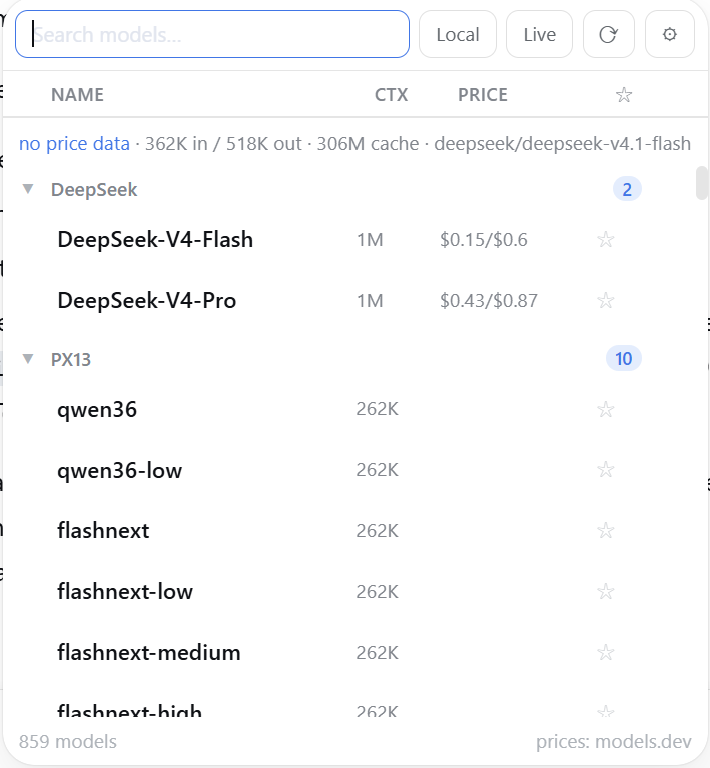

<div align="center">

# 🎛️ dsh-model-chooser

*A searchable, sortable model picker for the DeepSeek Harness (DSH) Web UI — it fills the composer's model seat and answers a delegation's model question, with provider groups, favorites, models.dev prices, context windows, live per-task cost, a local-model filter, and a refresh button that re-syncs every provider model list from its live API.*

<!-- Horizontal Badge Navigation Bar -->
[](https://www.npmjs.com/package/dsh-model-chooser)
[](https://github.com/loonylabs-dev/dsh-model-chooser/actions)
[](https://nodejs.org)
[](#license)
[](https://github.com/loonylabs-dev/dsh-model-chooser)

</div>

> **Fork.** Based on [mrdevlorx/dsh-model-garden](https://github.com/mrdevlorx/dsh-model-garden) (MIT), forked at 0.7.1. The MIT copyright notice stays in [LICENSE](LICENSE) and the [Credits](#credits) name the upstream. Beyond the fork point this is our own plugin: it also answers a delegation's model question, so a subagent's route is picked in the same picker as the session's model.

<!-- Table of Contents -->
<details>
<summary>📋 <strong>Table of Contents</strong></summary>

- [Features](#features)
- [How it works](#how-it-works)
- [Installation](#installation)
- [Guarantees](#guarantees)
- [Configuration](#configuration)
- [Verification & Testing](#verification--testing)
- [Compatibility](#compatibility)
- [Known Limitations](#known-limitations)
- [Credits](#credits)
- [🤝 Contributing](#-contributing)
- [🔗 Links](#-links)
- [License](#license)

</details>

---

A searchable, sortable **model picker** for the [DeepSeek Harness](https://github.com/deepseek-ai) Web UI (`dsh web`). It fills two seats: the composer's model selector, and the model question a delegation asks before a subagent starts — the latter asked by [dsh-subagent-model](https://github.com/loonylabs-dev/dsh-subagent-model), whose README shows that dialog.

**The composer's model seat** — what the stock selector cannot do: search, provider groups, sortable columns, favorites, prices, live cost and a local-model filter:



The screenshot comes from a real session on `0.1.0-rc.7`, with the local PX13 gateway and a hosted route configured.

## Features

- **🔍 Instant search** across model names and descriptions
- **📊 Sortable table columns** — click `Name`, `Ctx` or `Price` to sort asc/desc; a third click returns to the provider-grouped view
- **⭐ Favorites** — star models, toggle favorites-only from the table header; persisted in `localStorage`
- **🙈 Hide & shrink** — a blacklist to make the picker smaller: hover a row and click **✕** to hide that model (or **✕** on a group header to hide a whole provider), then manage everything from the **⚙** button in the search bar — list what is hidden, un-hide single entries or click *show all*. Persisted in `localStorage`, so your trimmed list survives reloads; hidden settings never touch the DSH configuration document
- **🏠 Local tag** — providers are flagged *local* by their real endpoint (baseURL from settings: loopback / RFC1918 / LAN hostnames), never by price guesswork; the **Local** box next to the search input filters to them
- **▾ Collapsible provider groups** — collapse state is persisted per provider
- **🔄 Auto model-list update** — while the picker is mounted, the provider/model directory is re-loaded automatically every 5 minutes (configurable), so locally added models show up without reopening the panel
- **⟳ Manual refresh from the provider APIs** — the **⟳** button in the search row re-syncs **every** configured `llm-pi-ai` provider from its live `GET {baseURL}/models` and writes the merged model lists back to the configuration document (details [below](#refresh-button--in-the-picker)); while a pass runs the button shows `⟳ …` and is disabled, and a per-provider tooltip reports `+added / −removed` plus any error
- **🔌 Live inventory for local gateways** — for routes that point at a local gateway the picker asks the gateway itself which models it currently serves (`GET /model-chooser/server-models`, 5 s per route); the **Live** toggle next to **Local** then hides configured entries the gateway does not actually serve, while unreachable routes keep their configured list
- **💰 Model prices** from [models.dev](https://models.dev) (the same source OpenCode uses), shown as `$input/$output` per 1M tokens, cached for 24 h. **Subscription routes** (all-zero cost in the catalog, e.g. coding-plan providers) resolve a *reference price* from their pay-as-you-go provider via `PROVIDER_ALIASES`, so plan models still show what their tokens would cost at API rates; only true **local** models stay unpriced
- **🧠 Context windows** — read live from the host `llm` service (adapter-owned data, works for **local** providers like llama.cpp / Ollama-style gateways too), with models.dev as fallback
- **🎚️ Reasoning effort picker** — models that support reasoning levels get a compact dropdown right next to the model name in the chat composer, styled and opening **exactly like the model picker** (same trigger pill, same floating menu surface, ✓ marks the active level, click outside / `Esc` / selecting closes it). Picking a model starts it at the **adapter's own default level** (`reasoning.defaultEffort`) — the plugin never invents an effort the adapter did not ask for, so cost and latency stay as the adapter intends (with no declared default the field is omitted and the adapter decides); the dropdown re-selects the current model with the chosen effort — no clutter inside the picker panel
- **💸 Live per-task usage & cost** — real provider-reported token usage (from the session log) is **always shown** while the panel is open (`in / out / cache`). Each model's usage is multiplied by **its own** (reference) price — properly attributed even when a session switched models mid-way — the same math OpenCode uses (`usage × price`, not a heuristic)
- **🧾 Session cost breakdown** — hover the `approx cost` figure for a popup **sized like the picker and parked parallel on its left (1 px gap)**: a **table-style breakdown** with per-model totals (steps, In/Out/Cache in their own columns, ≈ cost) and a **timestamped step table**. **Clickable column headers** work like Excel / the main list (asc → desc → off, ▲/▼ indicator) on both tables; **copy** the summary or **export the (sorted) step list as CSV** (Excel-ready). The invisible hover target spans the cost row all the way to its left edge. Attribution of each step to its model comes straight from the session log (`request/context` events); nothing extra is stored
- **🖱️ Detail tooltip** that opens *beside* the panel (never covers the list): description, price, context window, max output, reasoning efforts
- **🎨 Native look** — built on the harness design tokens only (`--dsw-alias-*`, `--dsw-elevation-prominent`, `--dsw-specific-menu`); the picker panel and the effort menu use the **native menu geometry** (radius 20 px, elevation stroke, no border, no artificial darkening of the surface), while the detail tooltip and the cost popup are 12 px cards on the same surface token — light & dark themes follow the harness exactly

## How it works

The package is a **static profile plugin** with two halves:

| Half | File | Role |
|---|---|---|
| Client | `client.js` | Registers the `conversation.input.model` slot (priority `-1`, shadowing the native seat), and a `conversation.composer` chain entry (priority `-1`) that answers a delegation's model question |
| Host | `index.js` | Serves same-origin JSON routes on the harness `webServer` service (cost, cost-history, catalog, server-models, refresh-models) |

### Two places the picker answers

1. **The chat's model seat.** The session's own model, committed through the harness's model directory (`directory.select`).
2. **A delegation's model question.** When another plugin asks which model should run a delegated child — the [dsh-subagent-model](https://github.com/loonylabs-dev/dsh-subagent-model) asks one question per delegation, id `subagent-model` — this picker claims the composer **only while that question is pending** and renders the same list. Every other question keeps the stock question card.

The delegation dialog is deliberately read-only against the session: it lists the session's models, prices, context windows, favorites and hidden-model settings, but it never calls `directory.select()`. That would change the model of the chat you are in, while this answer belongs to the delegating tool call. The answer goes back through the question carrier instead, exactly as the harness encodes it.

What the dialog sends:

| Action | Answer | Effect |
|---|---|---|
| Clicking the row marked ✓ (the route the child would inherit) | the router's own parent answer, as a selection | no override: the child runs on the inherited route |
| Clicking any other row | `provider::model`, as the answer's **free text** | the child runs on that route, after the router checks it against the live `llm` catalog |
| A lane from **Quick choices** | that lane's label, as a selection | the router's configured route, one click |
| "Don't ask again this session" | the router's auto answer, as a selection | no further questions in this session |
| ✕ | the harness's `cancelled` encoding | the router keeps its configured default |

The route separator is `::`, not `/`, because a model id may itself contain a slash (`requesty::anthropic/claude-haiku-4-5`) — the same key format as this plugin's own catalog.

**Why a chosen model travels in the free-text field.** The host validates an answer's `selected` labels against the question's own offered options and refuses anything else with `bad-response` (`matchesQuestions` in `packages/host/apiproxy`). This dialog's list is the session's live catalog, not the question's options, so a picked route is sent as the protocol's `custom` answer — which the same validator accepts, and which a single-choice question requires *instead of* a selection. A model that is one of the offered options (a lane, the inherited route, the auto answer) still travels as a plain selection.

In a subagent session the entry withholds itself, exactly as the seat does, so a delegated child never answers its own delegation question.

### Refresh button (⟳ in the picker)

A **⟳** button in the picker's search row re-syncs **every configured `llm-pi-ai` provider** from its live model API:

```
POST /model-chooser/refresh-models
  → { summary, invalidateCatalog, results: [ { id, ok, changed, total, added, removed, error } ] }
```

The host reads the configured provider routes from the settings service, resolves each credential through the **credentials service** (`~/.dsh/.credentials.yaml`) with process env as fallback, queries the provider's OpenAI-compatible `GET {baseURL}/models`, and merges the live ids into the settings `models` lists — **existing entries keep every hand-tuned field and their order**, new ids arrive as minimal entries (OpenRouter entries carry live metadata), removed ids drop out. Changed lists are written back comment-preserving and hot-reload through `llm-pi-ai`, exactly as if a human had edited `settings.yaml`. A one-line German summary plus a per-provider tooltip report the result right in the picker.

The same logic is available as a standalone CLI that works without a running DSH — handy for cron or scripting:

```
node dsh-model-chooser/bin/refresh-models.mjs [--dry-run] [--provider <id>]
       [--keep-removed] [--timeout-ms <ms>] [--home <dsh-home>]
```

### Host endpoints

```
GET /model-chooser/cost?session=<sessionId>
  → { inputTokens, outputTokens, cacheReadTokens, cacheWriteTokens, reasoningTokens, steps }

GET /model-chooser/cost-history?session=<sessionId>&limit=<n>
  → { steps: [ { time, provider, model, turn, step, inputTokens, outputTokens, cacheReadTokens, cacheWriteTokens, reasoningTokens } ] (newest first, capped),
      models: [ { provider, model, steps, inputTokens, outputTokens, cacheReadTokens, cacheWriteTokens } ],
      totalSteps }

GET /model-chooser/catalog
  → { "provider::model": { local, context?, maxOutput? } }   (cached 10 min)

GET /model-chooser/server-models
  → { providers: { "<id>": { models: [ "<id>", … ] } | { error } } }   (live probe of local gateways)

POST /model-chooser/refresh-models
  → { summary, invalidateCatalog, results: [ … ] }   (see "Refresh button" above;
     405 on another method, 403 on a cross-site request, 409 while a pass is
     already running — exactly one pass at a time — 504 on timeout)
```

The cost endpoint aggregates the real `usage` payloads of `assistant/message` events from the durable session log — no estimation. The cost-history endpoint additionally attributes each usage step to the model in effect: `assistant/message` events carry usage but not the model, so it tracks `request/context` (and `request/header`) events, which precede the request they describe with `{ provider, model }` — a single pass over the same in-memory events, no extra persistence. The catalog endpoint resolves `contextWindow` / `defaultMaxTokens` per model through the host `llm` service (`resolveModelInfo`), so local/self-hosted providers report their real limits. Every route is **same-origin only**: no CORS wildcard is advertised, and the state-changing refresh rejects a cross-site request with `403` before it touches a provider — a website open in the same browser can neither read session usage nor trigger a re-sync with your stored provider credentials.

## Installation

One command — the official plugin CLI installs the package **and** mounts it (the package carries a `dsh.bundle.patch` layer, so the CLI automatically appends it to the profile's bundle stack):

```sh
dsh plugin --profile <profile> add dsh-model-chooser
```

Then restart the DSH server and hard-refresh the browser (`Cmd/Ctrl+Shift+R`).

> The host half needs the web stack (`webServer` service). In minimal/TUI profiles without it the plugin stays inert by design — boot is never blocked.

> Upgrading from a manual install? Remove the old `model-chooser` dependency and any manual `- insert:` row for it from your profile's `cordis.patch.yml` first — otherwise the plugin mounts twice.

### Manual install (without the CLI)

If you manage the profile with plain npm: add the dependency, list `dsh-model-chooser` in `dsh.profile.bundles` in the profile `package.json`, reinstall, restart. The bundle patch inside the package inserts the loader row for you — no `cordis.patch.yml` edit needed.

### Updating an installed copy

The profile installs this package **from npm** (`dsh-model-chooser@^0.1.x`). To ship a change: run `npm test`, bump the version, `npm publish` (whose `prepublishOnly` runs the tests), then `dsh plugin --profile <profile> install`. A client-half change needs a page reload after that, because the module server serves `client.js` per request; a host-half change needs a restart.

A `file:` install behaves differently, and the difference bites: `pnpm` hard-links each file, and the file tools replace a file rather than writing through it, so the profile silently keeps the previous content while your working tree moves on. If you develop against a `file:` install, delete `profiles/<profile>/node_modules/dsh-model-chooser` and re-run the install after every edit.

## Guarantees

**The picker never changes a model you did not choose.** The seat commits the session's model; the delegation dialog commits nothing to the session at all. It answers the delegating tool call, and the plugin that asked decides what to do with the answer.

**The dialog is the harness's own question surface.** It answers with the encoding the harness defines (`respond({ok: true, value: {sessionId, answer}})`), read out of the installed client rather than guessed, so a question the router asked is a question it receives back.

**Nothing is added to a prompt.** No tool, no prompt section, no instruction text: what the model sees is unchanged by installing this plugin. Prices, cost panels, and favorites are browser-side and host-route data only.

**A profile without the web stack stays bootable.** The host half mounts inert (`inject: []` plus a retry on service availability), so a minimal or headless profile never parks a fiber or blocks the boot.

**Only one model picker per profile.** The composer seat is a shadowing slot at priority `-1`; a second picker at the same priority fails at boot by design instead of silently winning.

## Configuration

No configuration is required. Several tweakable constants live at the top of the respective file:

- **Auto model-list update interval** — `MODEL_LIST_REFRESH_MS` in `client.js` (default 5 min) controls how often the provider/model directory is reloaded while the picker is mounted.
- **Hidden provider routes** — `HIDDEN_PROVIDER_PREFIXES` in `client.js` (and `SKIP_PREFIXES` in `index.js`). Some plugins mirror providers as internal routes (e.g. a vision toolkit duplicating every provider as `vision-toolkit-<id>`); such prefixes are excluded from the picker and the catalog.
- **Price aliases** — `PROVIDER_ALIASES` / `MODEL_ALIASES` in `client.js` map DSH route ids to models.dev catalog ids. They serve two cases: renamed routes (`deepseek-official` → `deepseek`) and subscription routes whose catalog entry is all-zero (`kimi-for-coding` → `moonshotai`, `alibaba-tp` → `alibaba-cn`, `oneprovider` → `anthropic`), giving plan models their pay-as-you-go reference price.
- **Price cache TTL** — `PRICE_TTL` (default 24 h) and **catalog TTL** — `CATALOG_TTL` (default 10 min).
- **Refresh timing** in `index.js` — `REFRESH_TIMEOUT` (default 15 s per provider), `REFRESH_HARD_CAP_MS` (default 60 s hard fence for a whole refresh pass) and `SERVER_MODELS_TIMEOUT` (default 5 s per local gateway probe for the **Live** inventory).

Favorites, collapsed providers, the hidden-models/provider blacklist (`dsh.modelchooser.hidden`) and the price cache live in the browser's `localStorage` under `dsh.modelchooser.*`.

## Verification & Testing

```bash
npm test   # 41 tests, under a second: host routes, refresh arithmetic, and the dialog
```

The three lanes are described in [CONTRIBUTING.md](CONTRIBUTING.md). The one that covers the delegation dialog loads `client.js` through the harness's own module seam with React stubbed out, so the rendered list and the answers it delivers are asserted without a browser.

Two checks against a running server:

```bash
curl -s http://127.0.0.1:3080/model-chooser/catalog | head -c 200
# → {"deepseek::deepseek-chat":{"local":false,"context":...}, ...}  (JSON, not HTML)

curl -s http://127.0.0.1:3080/ | grep -o 'dsh-model-[a-z]*'
# → the client rows the boot actually mounts; exactly one model picker may appear
```

Then delegate something in the chat: the picker appears in place of the question card, and the child's own session log names the route it ran on.

## Compatibility

Verified by us on `@deepseek-ai/dsh 0.1.0-rc.7` — the installed harness this fork was adopted against: the plugin mounts, the seat renders, and the delegation dialog answers. Upstream's own range claim for the code before the fork point is `0.1.0-rc.6` … `0.1.5-rc.1`.

The client half is plain React via `window.__ModuleLoader__` — no build step, no dependencies. Both halves talk to the harness through documented surfaces (slots, `modelDirectories`, `webServer` routes, the question carrier's answer encoding), so a harness release that changes one of those contracts is what would break it.

The cost endpoints read the durable session log through the session facade (`snapshotEvents()`, falling back to `ownEvents()` and to the older public `events` array), so token usage and the cost breakdown work across session-facade generations.

> **Inject note — read before touching `exports.inject`.** The client entry declares `["slots", "sessions", "remote"]`. cordis has no optional inject: every name there **gates activation**, and `dsh-app-boot` fails the **entire web boot** when one entry never leaves `pending` (`web boot: 1 entry did not activate`). A name the harness does not provide is therefore not a harmless extra guard — it takes the whole UI down, and no server-side check can see it, because that boot runs in the browser. The fork base (0.7.1) declared `remote.session`; no such service exists in `0.1.0-rc.7` **or** in the newer `0.1.1-rc.2` source, which is what broke the boot when this package replaced the older upstream release. The Remote namespaces that do exist are `remote.commands`, `remote.fileReferences`, `remote.goals`, `remote.localhost`, `remote.messageFeedback`, `remote.pluginInventory` and `remote.sessionReferenceResolver`. The list is pinned by a case in `test/delegation-chooser.client.test.js`; changing it is a decision, not a reflex.

## Known Limitations

1. **The seat and the delegation dialog are two render paths.** They share the module-level helpers and the `mg-*` classes, so they look the same, but they are not yet one list component. Unifying them is a deliberate later step: the seat is the daily chat UI and the fork brought no UI tests for it.
2. **Favorites, collapsed providers and the hidden list reset once** when a profile moves from the upstream `dsh-model-garden` to this package, because the storage keys moved from `dsh.modelgarden.*` to `dsh.modelchooser.*`.
3. **Only one model picker per profile.** Installing this package alongside the upstream `dsh-model-garden` fails at boot: both register `conversation.input.model` at priority `-1`, and a same-priority second registration throws.
4. **The delegation dialog needs a session model directory.** A session the host cannot resolve for a model directory degrades to the router's own plain options instead of the picker.
5. **Prices come from models.dev and can be absent.** Subscription routes show a reference price; a route models.dev does not know shows none, and a local gateway is deliberately unpriced. Sort order puts unpriced routes last.
6. **The refresh button writes to your settings.** It re-syncs the `llm-pi-ai` provider model lists from their live APIs, which is a write to `settings.yaml`; it is loopback-only and rejects cross-site POSTs.
7. **The fork base carried a boot-breaking inject.** Upstream 0.7.1 declared `remote.session`, a service that exists in no harness version we could inspect. On `0.1.0-rc.7` that parked the client entry and failed the whole web boot; it is fixed here, and the list is pinned by a test. The lesson is in the inject note above: at this boundary, a wrong name is a total outage, not a missing feature — and it is invisible to every server-side check.

## Credits

- Fork origin: [mrdevlorx/dsh-model-garden](https://github.com/mrdevlorx/dsh-model-garden) (MIT)
- Pricing data: [models.dev](https://models.dev) API (also used by [OpenCode](https://github.com/anomalyco/opencode))
- Design tokens & slot API: DeepSeek Harness

## 🤝 Contributing

See [CONTRIBUTING.md](CONTRIBUTING.md) for the nine rules this plugin is built on, the layout, and how the three test lanes run.

## 🔗 Links

- [dsh-subagent-model](https://github.com/loonylabs-dev/dsh-subagent-model) — the plugin whose model question this picker answers
- [dsh-cache-guard](https://github.com/loonylabs-dev/dsh-cache-guard) — the sibling plugin that prices automatic context rewrites
- [dsh-pathfix](https://github.com/loonylabs-dev/dsh-pathfix) — the sibling plugin that repairs whitespace-broken path arguments
- [DeepSeek Harness](https://github.com/deepseek-ai) — the harness this plugin extends

## License

[MIT](LICENSE) © loonylabs-dev — with the upstream copyright notice kept as the license requires.
